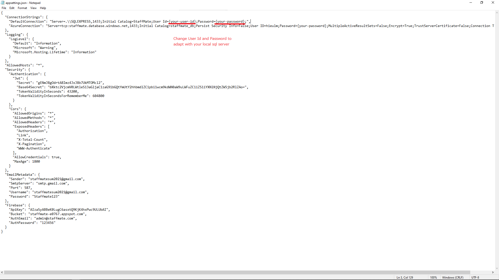

# RecipeManagement - Support Employee Training

## Local set up
1. [.NET 5 SDK](https://dotnet.microsoft.com/download/dotnet/5.0) 
2. [Microsoft SQL Server](https://www.microsoft.com/en-us/sql-server/sql-server-downloads)

## Run in local
1. Launch project folder
2. Change connection string to adapt with your local sql server in appsettings.json:

2. Install entity framework core using command: dotnet tool install --global dotnet-ef
3. Create database with command prompt using command (Skip if you already have db): dotnet ef database update
4. Build project using command: dotnet build
5. Run project using command: dotnet run
6. Launch https://localhost:5001/swagger/index.html for api document

## Or
- Lanuch for api document at: https://staffmate.azurewebsites.net/swagger/index.html